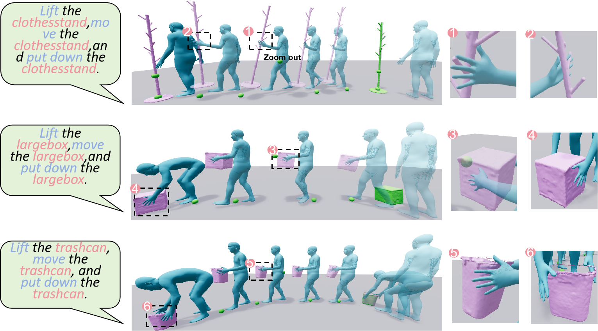

# MaMi-HOI



This repository contains the training, sampling, evaluation, and visualization code for MaMi-HOI, a text- and geometry-conditioned human-object interaction synthesis project on OMOMO-style manipulation sequences. Given language descriptions, object geometry, initial human/object states, and optional scene or path conditions, the model synthesizes coordinated human motion and object motion.

The main training and inference entrypoint is `train/trainer_control_GAPA_chois.py`. The repository also includes dataset utilities, evaluation code for text-motion metrics, Blender rendering helpers, and an interactive Viser viewer for generated mesh sequences.

## Environment Setup

The code is intended for a Linux CUDA environment. Python 3.8 is recommended, and the dependency versions below follow the tested CHOIS-style setup.

Clone the repo and enter the project folder.

```bash
git clone <this-repo-url>
cd MaMi-HOI
```

Create and activate a Conda environment.

```bash
conda create -n mami_hoi python=3.8
conda activate mami_hoi
```

Install PyTorch.

```bash
conda install pytorch==1.11.0 torchvision==0.12.0 torchaudio==0.11.0 cudatoolkit=11.3 -c pytorch
```

Install PyTorch3D.

```bash
conda install -c fvcore -c iopath -c conda-forge fvcore iopath
conda install -c bottler nvidiacub
pip install --no-index --no-cache-dir pytorch3d -f https://dl.fbaipublicfiles.com/pytorch3d/packaging/wheels/py38_cu113_pyt1110/download.html
```

Install `human_body_prior`, BPS, CLIP, and other dependencies.

```bash
git clone https://github.com/nghorbani/human_body_prior.git
pip install tqdm dotmap PyYAML omegaconf loguru
cd human_body_prior
python setup.py develop
cd ..

pip install git+https://github.com/otaheri/chamfer_distance
pip install git+https://github.com/otaheri/bps_torch
pip install git+https://github.com/openai/CLIP.git
pip install -r requirements.txt
```

For the optional Viser viewer:

```bash
pip install viser tyro natsort
```

## Prerequisites

Download the required SMPL/SMPL-H body models and place them under the processed data directory:

```text
processed_data/
  smpl_all_models/
    smplh_amass/
    ...
```

Prepare the processed interaction data and place it at `./processed_data`, or update `--data_root_folder` in the scripts. The data root is expected to contain files and folders such as:

```text
processed_data/
  train_diffusion_manip_seq_joints24.p
  test_diffusion_manip_seq_joints24.p
  cano_min_max_mean_std_data_window_120_joints24.p
  captured_objects/
  rest_object_geo/
  omomo_text_anno_json_data/
  contact_labels_npy_files/
  contact_labels_w_semantics_npy_files/
  replica_processed/
  unseen_objects_data/
  blender_files/
```

`bps.pt` should stay in the repository root. The dataset loader will create cached BPS and windowed-data files during the first run if they do not already exist.

Before running on a new machine, check the following path settings:


- Update data and checkpoint paths in `scripts/train_chois_omomo.sh` and `scripts/test_ours_long_seq_in_scene.sh`.
- update hard-coded local paths in:
  - `train/trainer_chois.py`
  - `train/trainer_control_GAPA_chois.py`
  - `manip/model/transformer_control_GAPA_motion_cond_diffusion.py`
  - `manip/data/cano_traj_dataset.py`
  - `manip/data/unseen_obj_long_cano_traj_dataset.py`

For Blender rendering, download Blender and update the following variables in `manip/vis/blender_vis_mesh_motion.py`:

```python
BLENDER_PATH = "/path/to/blender"
BLENDER_UTILS_ROOT_FOLDER = "/absolute/path/to/MaMi-HOI/manip/vis"
BLENDER_SCENE_FOLDER = "/absolute/path/to/processed_data/blender_files"
```

If you use `utils/vis_utils/render_res_w_blender.py`, update the same Blender and result paths in that file as well.

## Training

Train the main geometry-aware controllable HOI model:

```bash
bash scripts/train_chois_omomo.sh
```

The default script uses:

- `--window=120`
- text conditioning with `--add_language_condition`
- first human pose conditioning with `--input_first_human_pose`
- random-frame BPS conditioning with `--use_random_frame_bps`
- object keypoint/contact-related losses with `--use_object_keypoints`

By default, training outputs are saved to:

```text
chois_control_release_exp_output/
  chois_control_window_120_set1/
    opt.yaml
    weights/
    vis_res/
```

The trainer currently sets `WANDB_MODE=offline`. If you want online W&B logging, modify `train/trainer_control_GAPA_chois.py` and set `--entity` in the training script.

## Testing

Generate scene-aware long interaction sequences:

```bash
bash scripts/test_ours_long_seq_in_scene.sh
```

Before running, update:

- `--data_root_folder`: path to processed data.
- `--pretrained_model`: path to the trained checkpoint, for example `.../weights/model-9.pt`.
- `--save_res_folder`: output folder for generated sequences.
- `--test_object_name`: object name or `all`.
- `--test_scene_name`: Replica scene name, for example `frl_apartment_4`.

Useful testing flags include:

- `--test_sample_res`: run sampling instead of training.
- `--use_long_planned_path`: generate long sequences using planned paths.
- `--use_guidance_in_denoising`: enable guidance during denoising.
- `--test_unseen_objects`: test with objects from `processed_data/unseen_objects_data`.
- `--compute_metrics`: compute geometric/contact metrics instead of only generating visual results.

The testing script can compute part of the evaluation metrics, mainly the geometry-, contact-, waypoint-, penetration-, and motion-error metrics implemented in `t2m_eval/evaluation_metrics.py`. Distribution-level and text-motion consistency metrics such as FID, Matching Score, and R-precision should be computed separately with the evaluation pipeline described below.

Generated outputs are written under `--save_res_folder`, including `.npz` motion results, rendered videos, and per-frame human/object meshes depending on the selected options.

## Visualization

### Blender Rendering

The testing script can render videos through Blender if the Blender paths are configured correctly. It saves generated meshes first and then calls the utilities in `manip/vis/`.

For rendering generated results in a 3D scene, edit the paths in `utils/vis_utils/render_res_w_blender.py` and run:

```bash
cd utils/vis_utils
python render_res_w_blender.py
```

### Interactive Viser Viewer

The repository also provides `visualize_viser.py` for inspecting generated `.ply` mesh sequences interactively.

```bash
python visualize_viser.py --root-dir ./GAPA_chois_long_seq_in_scene_results/objs_single_window_cmp_settings/chois
```

The viewer supports sequence selection, frame scrubbing, human/object visibility toggles, waypoint display, floor controls, and simple camera movement.

## Evaluation

For text-motion evaluation such as Matching Score, R-precision, FID, and Diversity, use the code in `t2m_eval/`.

First generate `.npz` results for evaluation, then complete the evaluator configuration. This evaluation requires the feature extractors and related files provided by the CHOIS release, including the trained text-motion feature extractor, motion autoencoder/decomposition files, mean/std statistics, and GloVe/word-vector files used by the evaluator.

Place these files according to the paths used by the current code, or edit the paths before running. In particular, check:

- `t2m_eval/networks/evaluator_wrapper.py`: loads the text-motion feature extractor checkpoint. The current code expects a path like `checkpoints_dir/guanfang/text_motion_features/model/finest.tar`.
- `t2m_eval/motion_loaders/model_motion_loaders.py`: sets the GloVe/word-vector path for CHOIS evaluation.
- `t2m_eval/final_evaluations.py`: sets generated-result folders in `eval_motion_loaders`, the ground-truth folder in `gt_loader`, `batch_size`, `device_id`, and output log file.
- `t2m_eval/t2m_mean_std_jpos.p` and the relevant `meta/mean.npy` / `meta/std.npy` files: should match the evaluator and OMOMO/CHOIS feature format.

Then edit the result paths and ground-truth path in:

```text
t2m_eval/final_evaluations.py
```

Run:

```bash
cd t2m_eval
python final_evaluations.py
```

The evaluator uses OMOMO-style feature extractors and result loaders. Make sure the paths in `eval_motion_loaders` and `gt_loader` point to your generated `res_npz_files` folders.

## Generating Evaluation Data

Utilities for generating scene-aware long-sequence evaluation data are under:

```text
utils/create_eval_dataset/
```

To generate or modify planned-path data, update the local data paths in `create_eval_data.py` and run:

```bash
cd utils/create_eval_dataset
python create_eval_data.py
```

## Project Structure

```text
MaMi-HOI/
  data/                    # Body-model placeholders and contact vertex ids
  manip/
    data/                  # OMOMO/HOI dataset loaders
    model/                 # Diffusion model and GAPA/control transformer modules
    vis/                   # Blender visualization helpers
  scripts/                 # Training and testing shell scripts
  t2m_eval/                # Text-motion evaluation code and pretrained evaluators
  train/                   # Main trainer and sampling code
  utils/                   # Data processing, metrics, path planning, rendering utilities
  visualize/               # Extra mesh/motion visualization tools
  visualize_viser.py       # Interactive Viser sequence viewer
  bps.pt                   # BPS basis points
  requirements.txt
```

## Citation

Citation information will be added here.

## Related Repositories

Useful related repositories:

```text
https://github.com/lijiaman/chois_release
https://github.com/lijiaman/omomo_release
https://github.com/EricGuo5513/text-to-motion
https://github.com/lucidrains/denoising-diffusion-pytorch
https://github.com/jihoonerd/Conditional-Motion-In-Betweening
https://github.com/nghorbani/human_body_prior
https://github.com/otaheri/bps_torch
```
